This is the main document for configuring and showcasing the demo to the
customer.

[<u>Disclaimer</u>](#disclaimer)

[<u>Architecture</u>](#architecture)

[<u>ServiceNow Configuration</u>](#servicenow-configuration)

> [<u>Request a snow developer
> instance</u>](#request-a-snow-developer-instance)
>
> [<u>Retrieving the instance
> details</u>](#retrieving-the-instance-details)
>
> [<u>Add a custom field for the target
> hostname</u>](#add-a-custom-field-for-the-target-hostname)
>
> [<u>Add a Custom Field to the Incident
> Table</u>](#add-a-custom-field-to-the-incident-table)
>
> [<u>Clean up the existing
> Incidents</u>](#clean-up-the-existing-incidents)
>
> [<u>Configure the Incident Manager
> user</u>](#configure-the-incident-manager-user)
>
> [<u>Password reset</u>](#password-reset)
>
> [<u>Get the user System ID</u>](#get-the-user-system-id)
>
> [<u>Setup a User for the incident
> creation</u>](#setup-a-user-for-the-incident-creation)

[<u>Ansible Automation Platform
Setup</u>](#ansible-automation-platform-setup)

> [<u>Create the AAP demo
> environment</u>](#create-the-aap-demo-environment)
>
> [<u>Import the database containing a pre-existing Workflow
> Template</u>](#import-the-database-containing-a-pre-existing-workflow-template)
>
> [<u>Configuring the hosts</u>](#configuring-the-hosts)

[<u>OpenShift & OpenShift AI Setup</u>](#openshift-openshift-ai-setup)

> [<u>Create the OCP AI demo
> environment</u>](#create-the-ocp-ai-demo-environment)
>
> [<u>OpenShift S3 Storage configuration with
> Minio</u>](#openshift-s3-storage-configuration-with-minio)

[<u>Demo showcase</u>](#demo-showcase)

> [<u>OpenShift AI Setup</u>](#openshift-ai-setup)
>
> [<u>Data connection</u>](#data-connection)
>
> [<u>Workbench creation</u>](#workbench-creation)
>
> [<u>Working with the Workbench</u>](#working-with-the-workbench)
>
> [<u>The Incident Classification</u>](#the-incident-classification)
>
> [<u>Model training: Text Classification
> notebook</u>](#model-training-text-classification-notebook)
>
> [<u>Jupiter Notebook Quick
> Introduction</u>](#jupiter-notebook-quick-introduction)
>
> [<u>Setup the prerequisites</u>](#setup-the-prerequisites)
>
> [<u>Git LFS</u>](#git-lfs)
>
> [<u>Hugging Face</u>](#hugging-face)
>
> [<u>Loading the dataset</u>](#loading-the-dataset)
>
> [<u>Training the mode</u>](#training-the-mode)
>
> [<u>OpenVINO model conversion</u>](#openvino-model-conversion)
>
> [<u>Notebook execution</u>](#notebook-execution)
>
> [<u>Some considerations on the First Training
> Notebook</u>](#some-considerations-on-the-first-training-notebook)
>
> [<u>Uploading the model on S3
> Storage</u>](#uploading-the-model-on-s3-storage)
>
> [<u>Deploy the model on OpenVINO multi-model
> server</u>](#deploy-the-model-on-openvino-multi-model-server)
>
> [<u>OpenVINO quick introduction</u>](#openvino-quick-introduction)
>
> [<u>Model Deployment</u>](#model-deployment)
>
> [<u>Testing the model on OpenVINO multi-model
> server</u>](#testing-the-model-on-openvino-multi-model-server)
>
> [<u>OpenShift Microservices Setup</u>](#openshift-microservices-setup)
>
> [<u>Deploying the ai2aap-predict-text-ws
> microservice</u>](#deploying-the-ai2aap-predict-text-ws-microservice)
>
> [<u>The ai2aap-snow-incidents-resolution
> microservice</u>](#the-ai2aap-snow-incidents-resolution-microservice)
>
> [<u>Create Incidents on ServiceNow and monitor the automatic
> resolution</u>](#create-incidents-on-servicenow-and-monitor-the-automatic-resolution)
>
> [<u>The incidents creation script</u>](#the-incidents-creation-script)
>
> [<u>Monitoring Ansible Jobs</u>](#monitoring-ansible-jobs)
>
> [<u>Monitoring the OpenShift
> microservice</u>](#monitoring-the-openshift-microservice)
>
> [<u>Monitoring tickets on
> ServiceNow</u>](#monitoring-tickets-on-servicenow)
>
> [<u>Incidents creation</u>](#incidents-creation)

# Disclaimer

We invested a lot of time and effort into the demo but we didn’t
automate it yet.

The demo setup is split between the four different platforms:

-   ServiceNow

-   Ansible Automation Platform

-   OpenShift

-   OpenShift AI

This document has the aim of teaching how to set up the demo but also
how to live demonstrate it to a potential customer.

We are conscious that we could automate the ServiceNow setup as well as
the OpenShift / OpenShift AI with Ansible Automation Platform and/or
ArgoCD but we didn’t get so much time to develop it yet.

# Architecture

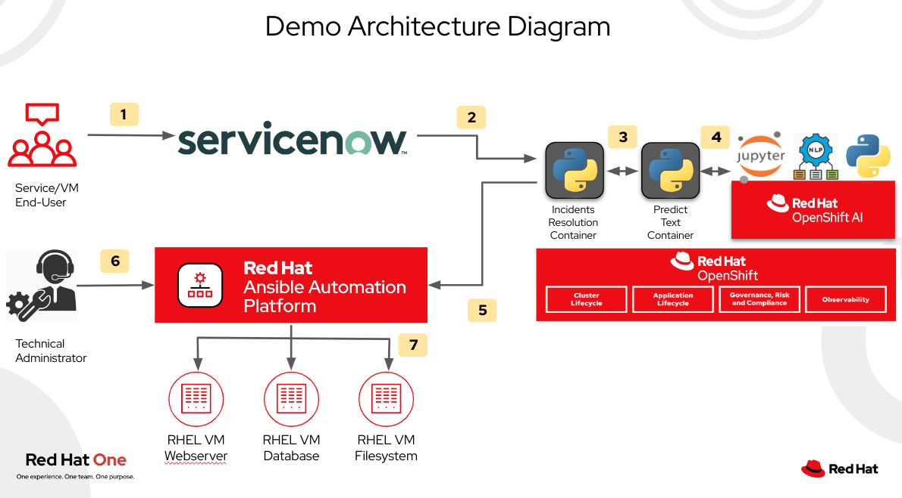

This an high level diagram of the Demo with the workflow we developed:

1.  The service/vm’s end user will open an incident on ServiceNow to
    report an issue on one of the target VMs managed by Ansible
    Automation Platform.

2.  Open and unassigned incidents will be pulled by a Python
    microservice (ai2aap-snow-incidents-resolution) running as a
    container on OCP

3.  The Python microservice will then request the Text Classification
    through another Python microservice (ai2aap-predict-text-ws) running
    on OCP

    1.  This could be useful to show to the customers that they could
        decouple the AI components from the container services

4.  The Python Text Classification service will then interact with the
    trained and running AI model on OpenShift AI to get a proper
    classification

5.  After that the Python microservice **Incidents Resolution** will be
    ready to call via API the Ansible Automation Platform, passing all
    the information needed to try to automatically resolve the issue

6.  The Technical Administrator could be enabled to approve the
    Automation execution

    1.  This is disabled by default in the demo but could be
        live-demonstrated as well by showing to the customer the Ansible
        Automation Platform option in the Workflow template

7.  Ansible Automation Platform will then execute the proper automation
    on every target server knowing the Text Classification made by an AI
    model running on OpenShift AI.

# ServiceNow Configuration

## Request a snow developer instance

First we need to request a developer instance going to:
[<u>https://developer.servicenow.com/</u>](https://developer.servicenow.com/)

If you have not an account please register (also with your Red Hat
email) and after that click on request instance button:

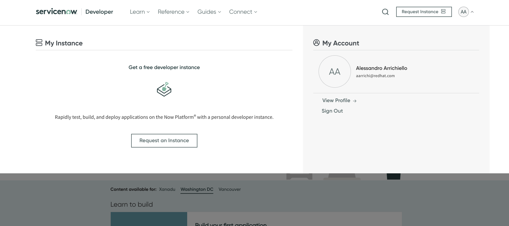

We are going to select the Washington release:

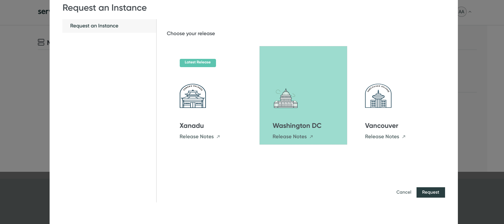

After that wait until the instance is ready to be accessed.

Once ready click on the “start building” button:

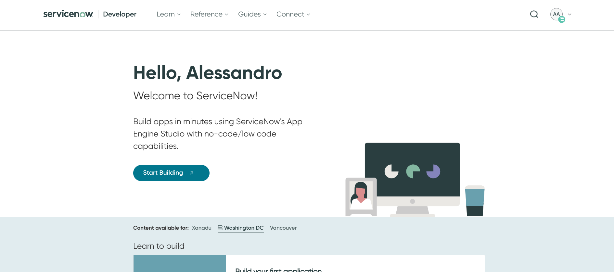

You will be redirected to the main Service Now instance page
automatically logged in as admin.

## Retrieving the instance details

After some time without any action the browser session on the instance
will be reset, in that case you will need to log-in again.

In order to login, you will need the access credentials and URL.

You can see the ServiceNow instance details (URL, username and password)
clicking on the top-right profile icon on
[<u>https://developer.servicenow.com/</u>](https://developer.servicenow.com/)
and then selecting Manage instance password.

<table>
<colgroup>
<col style="width: 100%" />
</colgroup>
<thead>
<tr class="header">
<th><strong>IMPORTANT</strong>: Instances with no activity for over 10
days will be claimed back from ServiceNow</th>
</tr>
</thead>
<tbody>
</tbody>
</table>

### 

## Add a custom field for the target hostname

As reported in this ServiceNow solution[1] we need to define a custom
field for reporting and tracking the hostname for the target
system/device we need to launch the automatic resolution on.

### Add a Custom Field to the Incident Table

1.  Navigate to (from the top bar): **All** &gt; **System Definition**
    &gt; **Tables**.

> 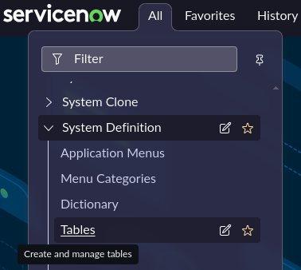 style="width:3.9375in;height:3.52083in" />

1.  Search for the **Incident** table and click on it

2.  Select **“New”** button in the Columns tab at the bottom:

    -   **Type:** String (Once you select String will appear the rest of
        the tabs listed below)

    -   **Column Label:** Host

    -   **Column Name:** u\_host

    -   **Max Length**: 50

    -   **Mandatory**: True

3.  Save the Field clicking on the **Submit** button.

Incident table:

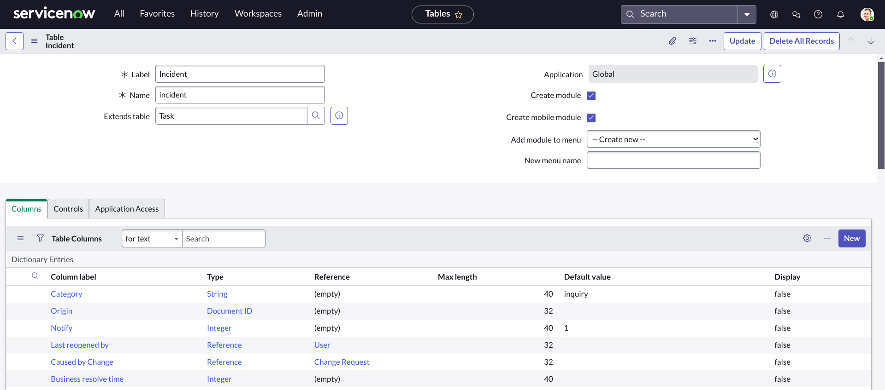

Record creation:

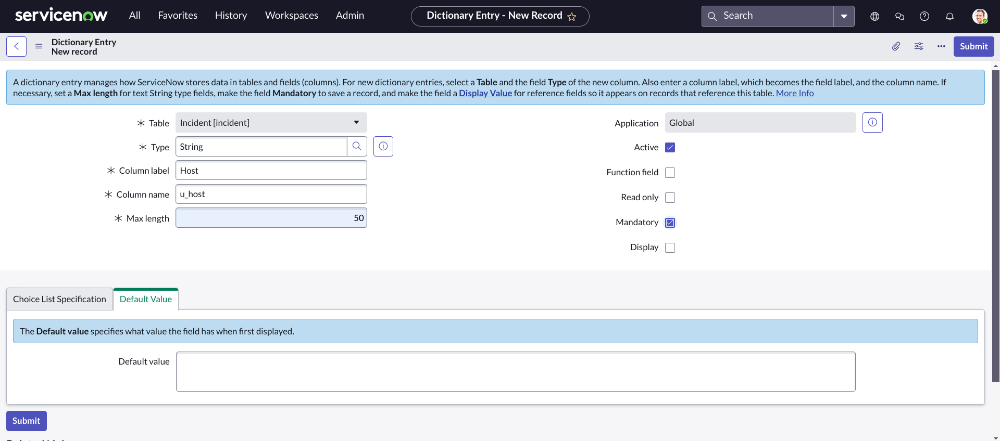

After that, you can double-check the existence of the **Host** field:

1.  Click on the top-left **All** menu

2.  Search for Incident and click on **Create New**

>  style="width:2.97396in;height:2.93462in" />

1.  The Host field should be present on the new incident form:  
    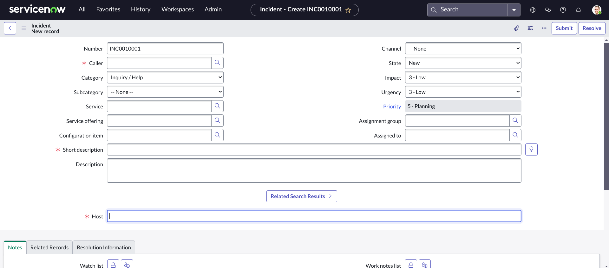

## Clean up the existing Incidents

Since we are going to query ServiceNow about any open ticket unassigned
and we need to ensure that the ticket has the correct custom field for
the hostname that we configured in the previous section, we need to
remove any existing incident.

Let’s navigate through the menu to the section **Service Desk** -&gt;
**Incidents**:

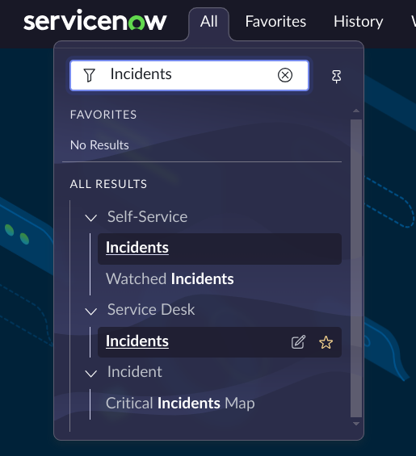

You should be presented with a similar view with more than 60 existing
incidents:

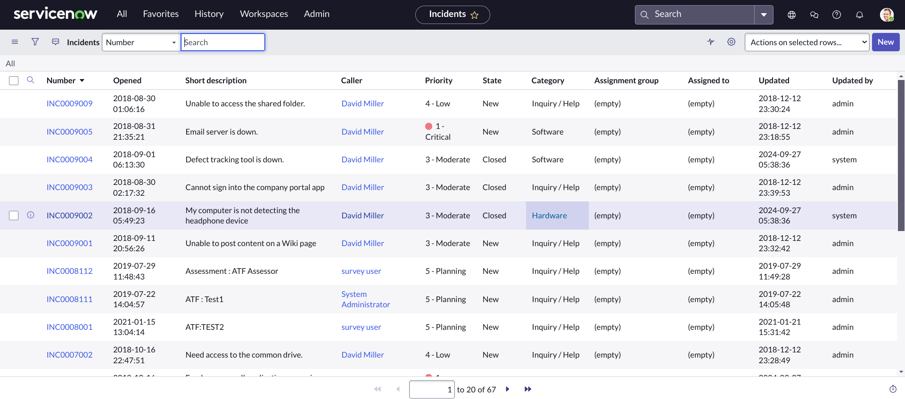

1.  Click on the top-left checkbox to select all the incidents

2.  On the top-right dropdown action menu, select
    **Delete**: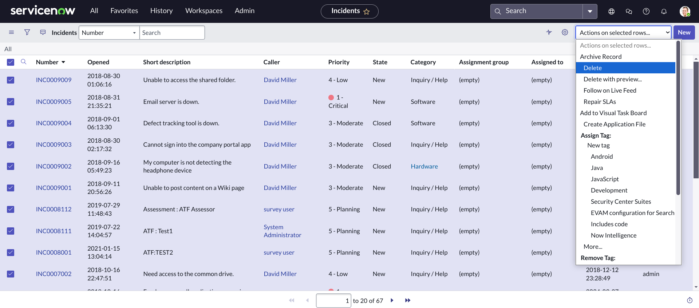

3.  The platform will ask for confirmation to delete any children item,
    confirm
    it: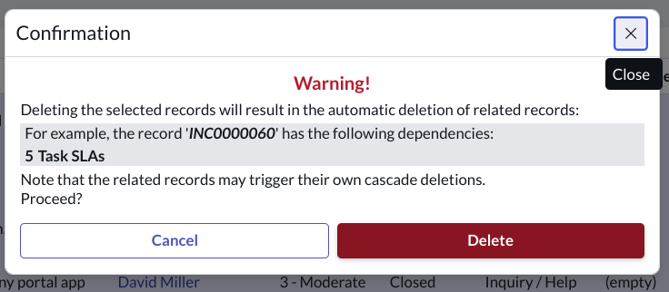

4.  Repeat this process until the Incident list is
    empty: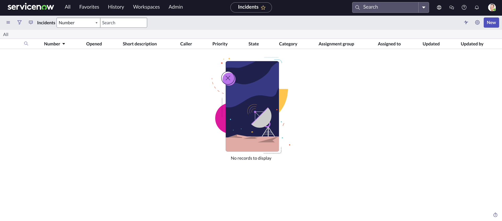

## Configure the Incident Manager user

### Password reset

For managing incidents through OpenShift Microservices and Ansible
Automation Platform we need a set of credentials to use for updating and
hopefully close the ticket.

We are going to re-use an existing user named **Incident.Manager**,
let’s change its password so we can use it in our demo.

1.  Let’s navigate through the menu to the section “Organization -&gt;
    Users”:  
    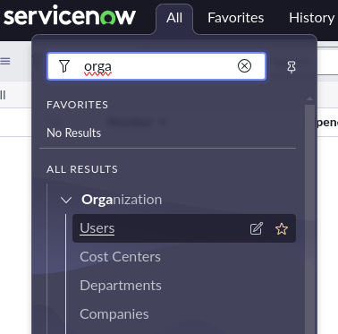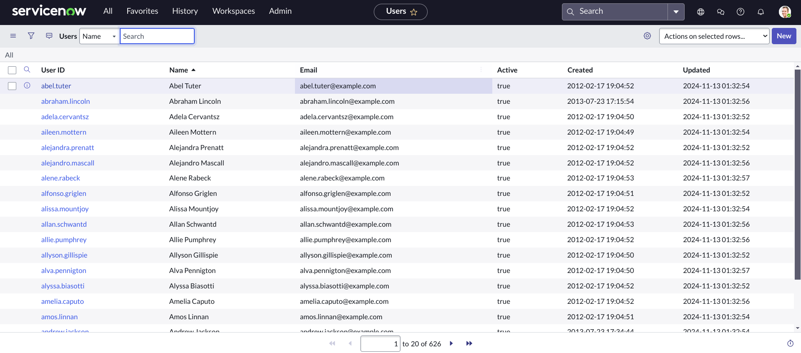

2.  Search for “**Incident Manager**” and click on the
    **Incident.Manager**
    user: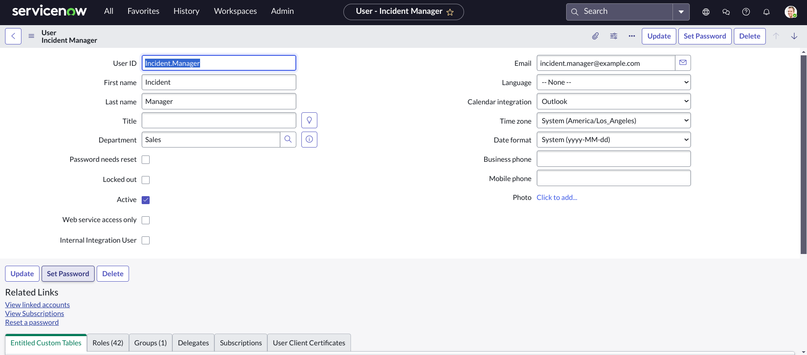

3.  After that we need to click on the **Set Password**
    button: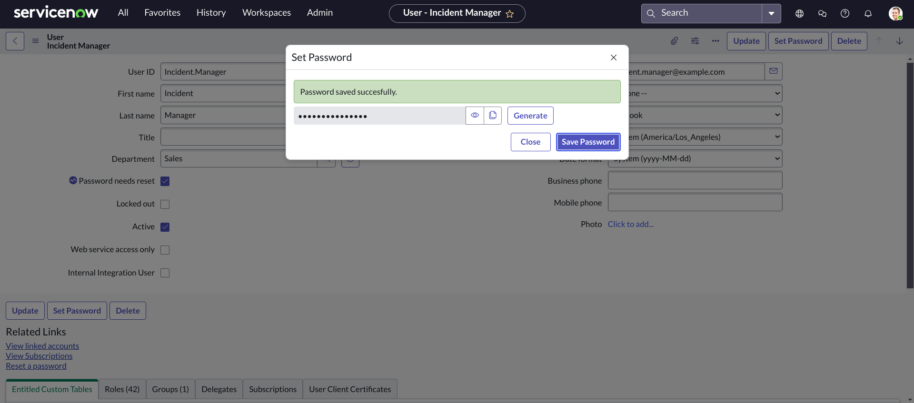

4.  Finally click on the **Generate** button, copy the password and
    click **Save Password** and close the change password pop-up.

5.  After that you have to remove the checkmark on the **Password needs
    reset** otherwise after the first login it will require a password
    change and finally you have to click on **Update** button on the
    bottom left.

<table>
<colgroup>
<col style="width: 100%" />
</colgroup>
<thead>
<tr class="header">
<th><strong>IMPORTANT</strong>: Save somewhere the newly generated
password: you will need it in next steps</th>
</tr>
</thead>
<tbody>
</tbody>
</table>

### Get the user System ID

The easiest way to get the user id is to copy the uid available in the
Web Browser Address URL Bar: search for the **sys\_id%3D**, copy all the
characters after the **D** and before the next **%**

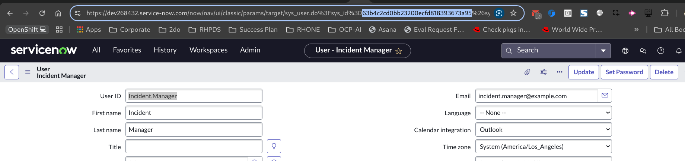

<table>
<colgroup>
<col style="width: 100%" />
</colgroup>
<thead>
<tr class="header">
<th><strong>NOTE:</strong> The default values available in the
ServiceNow Developer Instance should be the same, so the System ID for
the “Incident Manager” also on your instance should be:
<strong>63b4c2cd0bb23200ecfd818393673a95</strong></th>
</tr>
</thead>
<tbody>
</tbody>
</table>

<table>
<colgroup>
<col style="width: 100%" />
</colgroup>
<thead>
<tr class="header">
<th><strong>IMPORTANT</strong>: Save somewhere the User System ID: you
will need it in next steps</th>
</tr>
</thead>
<tbody>
</tbody>
</table>

## Setup a User for the incident creation

We need to choose another user for simulating the Incident Creation
during the demo. Following the previously described process, you could
pick up the user named “**Alejandro Mascall**” or any you want. Just
follow the same process we did for the “**Incident Manager**” user to
change its password.

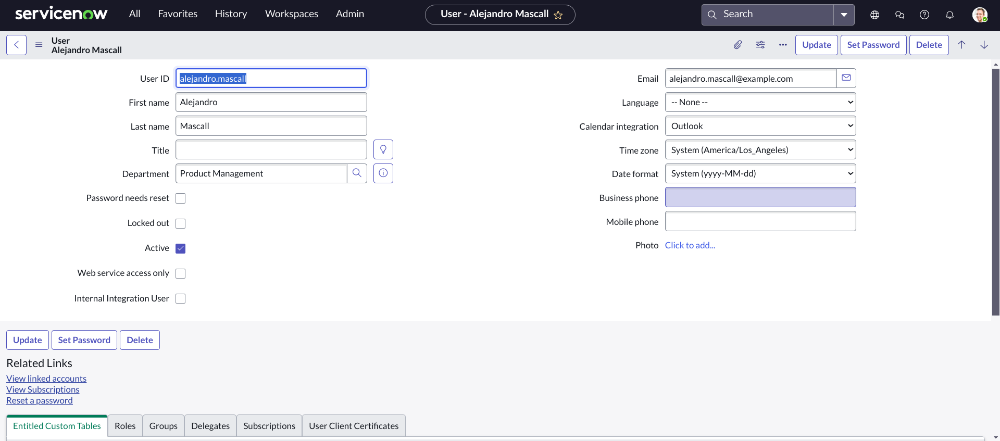

<table>
<colgroup>
<col style="width: 100%" />
</colgroup>
<thead>
<tr class="header">
<th>
<strong>IMPORTANT</strong>: Save also the user password, will be
needed during the demo.

You don’t need to take note of the System ID for this user.
</th>
</tr>
</thead>
<tbody>
</tbody>
</table>

# Ansible Automation Platform Setup

## Create the AAP demo environment

Red Hatters could request the demo lab named “Ansible Workshop - Ansible
for Red Hat Enterprise Linux”, if you are replicating in your own
environment you may need:

-   1 x Automation Controller

-   3 x RHEL hosts

## Import the database containing a pre-existing Workflow Template

Once ready you have to connect to the Automation Controller for
importing the backup with all the available configuration.

1.  Create the AAP-backup directory and download the backup file:

<table>
<colgroup>
<col style="width: 100%" />
</colgroup>
<thead>
<tr class="header">
<th>$ cd ~; mkdir -p AAP-backup; cd AAP-backup 
$ wget
https://raw.githubusercontent.com/alezzandro/ai2aap-ansible-playbooks/refs/heads/main/utils/controller-export-20240722.json</th>
</tr>
</thead>
<tbody>
</tbody>
</table>

1.  Download the latest **automation-controller-cli** package from RHN.
    (if your hosts are already connected to RHN you can just install it
    with **dnf**)

> Go to
> [<u>https://access.redhat.com/downloads/content/480/ver=2.5/rhel---9/2.5/x86\_64/packages</u>](https://access.redhat.com/downloads/content/480/ver=2.5/rhel---9/2.5/x86_64/packages)
> and search for **automation-controller-cli**:
>
> 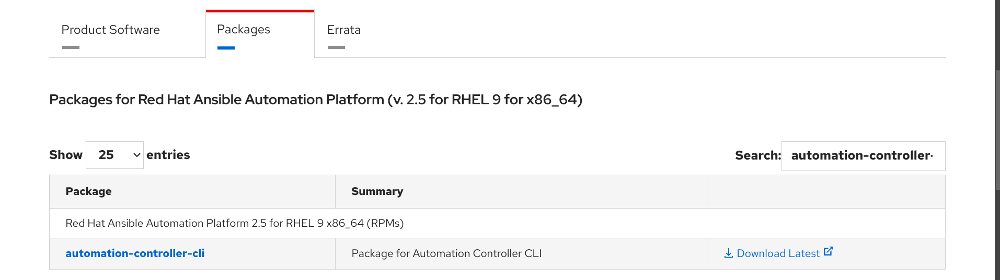
>
> Then right click on “**Download Latest**” button and paste it in the
> console, downloading it with wget:

<table>
<colgroup>
<col style="width: 100%" />
</colgroup>
<thead>
<tr class="header">
<th>$ cd ~; wget -O automation-controller-cli-4.6.rpm
‘link_you_copied’</th>
</tr>
</thead>
<tbody>
</tbody>
</table>

<table>
<colgroup>
<col style="width: 100%" />
</colgroup>
<thead>
<tr class="header">
<th><strong>NOTE:</strong> Ensure to paste the link between double
quotation marks to avoid any problem in the shell</th>
</tr>
</thead>
<tbody>
</tbody>
</table>

> Then we are ready to install the package and its dependencies:

<table>
<colgroup>
<col style="width: 100%" />
</colgroup>
<thead>
<tr class="header">
<th>$ sudo dnf install -y ./automation-controller-cli-4.6.rpm
python3.11-setuptools</th>
</tr>
</thead>
<tbody>
</tbody>
</table>

<table>
<colgroup>
<col style="width: 100%" />
</colgroup>
<thead>
<tr class="header">
<th>
<strong>NOTE: Alternatively</strong>, if you have issues
accessing the Red Hat CDN you can install the awxkit from the upstream
project:

<table>
<colgroup>
<col style="width: 100%" />
</colgroup>
<thead>
<tr class="header">
<th>
$ cd ~; sudo dnf install python-pip -y

$ pip install virtualenv

$ mkdir .venv; virtualenv .venv

$ . .venv/bin/activate

$ git clone https://github.com/ansible/awx.git

$ cd awx/awxkit

$ pip install .
</th>
</tr>
</thead>
<tbody>
</tbody>
</table></th>
</tr>
</thead>
<tbody>
</tbody>
</table>

1.  We are now ready to import the data (make sure to get the AAP
    Controller URL and password from the demo page):

<table>
<colgroup>
<col style="width: 100%" />
</colgroup>
<thead>
<tr class="header">
<th>$ cd ~ 
$ export AWXKIT_API_BASE_PATH=/api/controller/ 
$ awx import --conf.host $AAP_CONTROLLER_URL --conf.username admin
--conf.password “$AAP_ADMIN_PASSWORD” &lt;
AAP-backup/controller-export-20240722.json</th>
</tr>
</thead>
<tbody>
</tbody>
</table>

<table>
<colgroup>
<col style="width: 100%" />
</colgroup>
<thead>
<tr class="header">
<th><strong>NOTE:</strong> Give some time to the tool to import the
configuration and make sure to quote the password</th>
</tr>
</thead>
<tbody>
</tbody>
</table>

After importing the data you can login in the Ansible Automation
Platform web dashboard.

After logging in, from the left bar click on **Automation Execution**
-&gt; **Templates**, you should see a list of predefined templates:

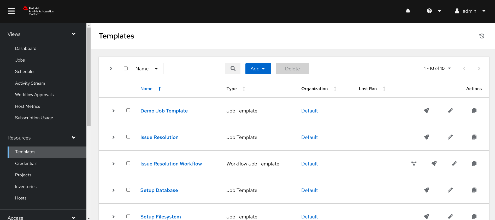

### Configuring the hosts

This demo comes with some configuration Job templates that must be
executed in order to setup the hosts

The demo defines three main categories for incidents classification:

1.  Web Server

2.  Database

3.  Filesystem

We will associate one host per each category:

-   node1 belongs to Web Server

-   node2 belongs to Database

-   node3 belongs to Filesystem

Launch the the “**Setup Database**” Ansible template clicking on the
rocket icon:

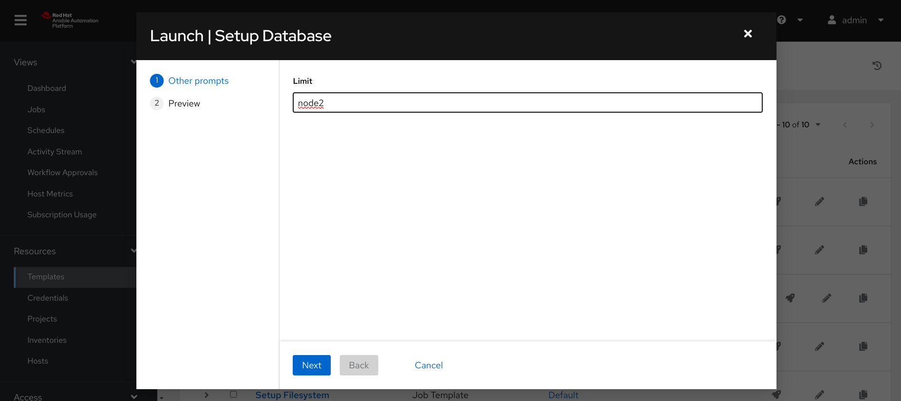

AAP will ask for a limit node, lets input our database: **node2**.

Then click Launch and Finish:

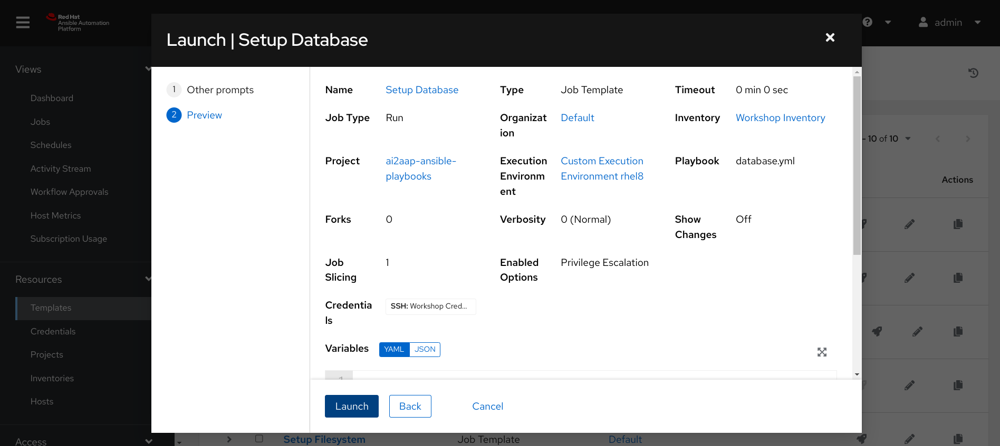

This will start the Ansible Playbook configuring base database service
on the target host (on which we can then simulate an issue).

Repeat the process for:

-   Setup Filesystem: **node3**

-   Setup Webserver: **node1**

We are ready to set up the next part of the infrastructure: OpenShift
and OpenShift AI.

# OpenShift & OpenShift AI Setup

<table>
<colgroup>
<col style="width: 100%" />
</colgroup>
<thead>
<tr class="header">
<th><strong>NOTE:</strong> this part it’s not resource intensive, this
actually means that in case you want to demonstrate this part of the
demo to your customer you could even run this section on the free tenant
provided by the Red Hat Developer Sandbox (that includes OCP +
OCP-AI).</th>
</tr>
</thead>
<tbody>
</tbody>
</table>

## Create the OCP AI demo environment

Red Hatters could request the lab named “Base RHOAI on AWS”, otherwise
you can create a base environment with OpenShift and OpenShift AI, as
mentioned before the demo use case does not require GPU, it can work
also with just a bunch of CPUs.

## OpenShift S3 Storage configuration with Minio

First of all the main prerequisite needed is an S3 storage solution to
host our AI/ML Models once trained/created in our Data Science Workbench
(usually it is a JupiterHub notebook environment).

Once the environment is ready, connect to the OpenShift cluster web
console with OpenShift user credentials:

Once logged in we can create our project **snow-incident-resolution** by
clicking the link **Create a new project**:

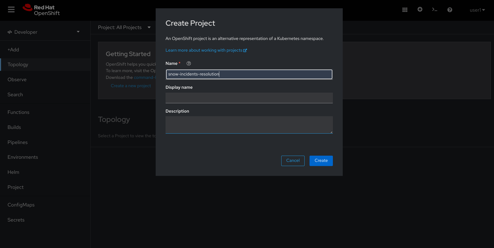

Then we are ready to setup the S3 Storage. First let’s start a
web-terminal, by clicking the respective button in the upper right
toolbar:

Then click on start button in the bottom dialog that will appear:

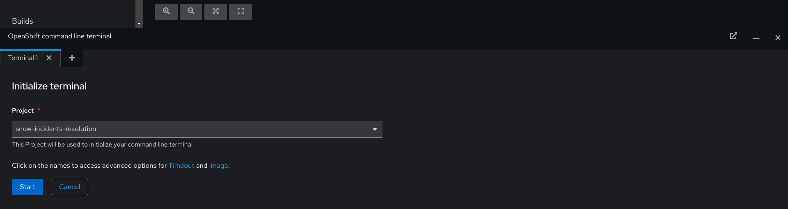

Now we can use the web terminal to deploy the minio setup:

<table>
<colgroup>
<col style="width: 100%" />
</colgroup>
<thead>
<tr class="header">
<th>$ oc apply -f
https://github.com/rh-aiservices-bu/fraud-detection/raw/main/setup/setup-s3.yaml</th>
</tr>
</thead>
<tbody>
</tbody>
</table>

The deployment starts, you should see something like this:

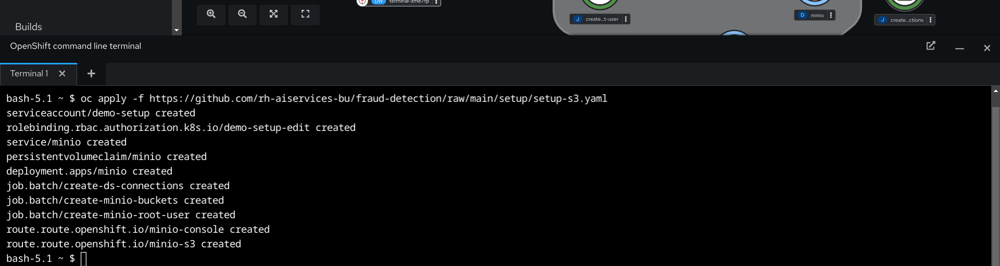

Once, from the Topology view, you can confirm the minio Deployment is
healthy is possible to continue with the next section

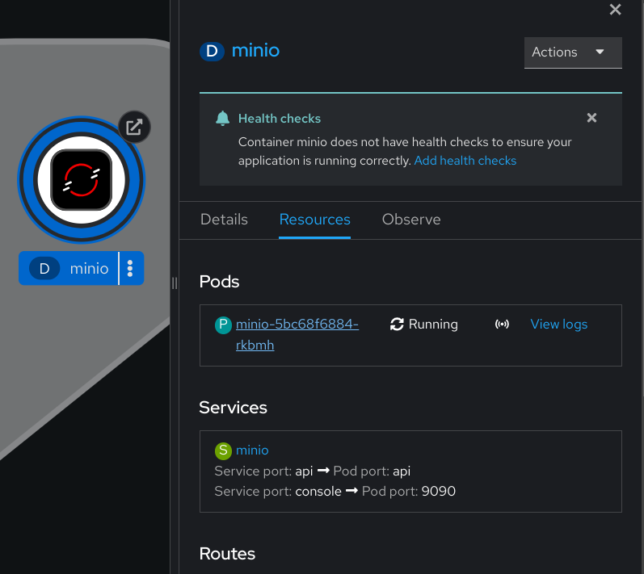

The demo environment comes with OpenShift AI already installed and
configured. How to setup OpenShift AI is not part of this lab.

<table>
<colgroup>
<col style="width: 100%" />
</colgroup>
<thead>
<tr class="header">
<th><strong>NOTE:</strong> The lab setup ends here, the following
sections of this document can be used as a script when showcasing the
demo.</th>
</tr>
</thead>
<tbody>
</tbody>
</table>

# Demo showcase

## OpenShift AI Setup

From the OpenShift web console, still with the **user1** account, we can
login in the OpenShift AI interface by clicking on the square icon on
the top bar and then selecting the entry “Red Hat OpenShift AI”:

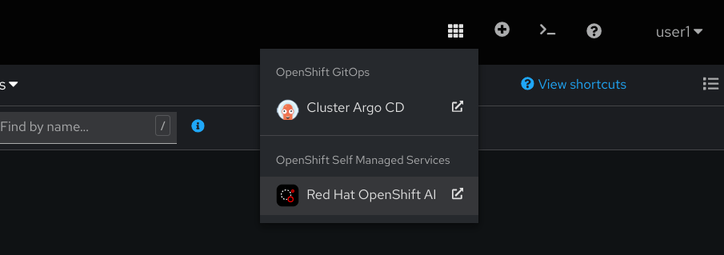

In case the platform requests a login again, you should use the same
**user1** credentials used before. Let’s click on the Data Science
project named **snow-incident-resolution**:

### Data connection

Inside the **snow-incident-resolution** Data Science project you should
see that in the tab **Data connections** two connections (‘MyStorage’
and ‘Pipeline Artifacts’) have been already created when we deployed the
minio yaml manifests.

### Workbench creation

We can now move on the Data Science project tab named **Workbench** and
click on the **Create workbench** button:

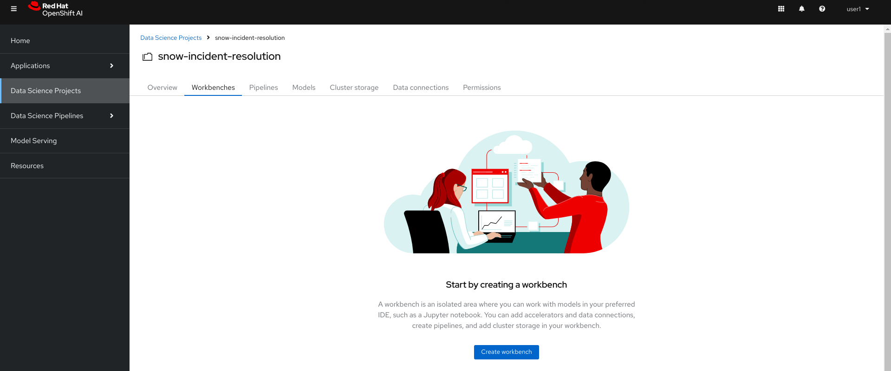

Our workbench should have the following details:

-   **Name**: bert-wb

-   **Image selection**: Minimal Python

-   **Version selection**: 2024.1

-   **Container size**: Medium (2 CPU, 8 GB Memory)

-   **Accelerator** (if present): none

-   **Cluster storage**: Create a new persistent storage with:

    -   Persistent storage size: 20 GB (please set at least 10 GB)

    -   Name: bert-wb

-   **Data connections**:

    -   Select **Use a data connection**

    -   Select **Use existing data connection**

    -   Choose **My Storage** connection

Once created you should have something similar to the following image on
your environment:

Then you can click on the **Open** link to access the just created
environment, you will be prompted to authorize the login via your
OpenShift credentials.

### Working with the Workbench

Once logged in your workbench, you have access to a JupyterLab
environment.

We are ready to start our machine learning experiments.

During the lab we will use a GitHub repository containing some ready to
use Notebooks for the BERT model training.

As a first step we have to clone the repository:

-   from the JupiterLab menu, click on **Git** -&gt; **Clone a
    Repository**

-   Insert into the repository URI
    [<u>https://github.com/alezzandro/ai2aap-model-training</u>](https://github.com/alezzandro/ai2aap-model-training)

-   Leave the **Include Submodules** checkbox flagged and click the
    **Clone** button

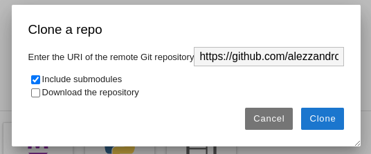

After cloning the repo you should have on the JupyterLab's file browser
a new folder named **ai2aap-model-training**, containing a set of
Jupyter Notebooks that we will explore during this article.

The content of the folder should be something similar to the following
image.

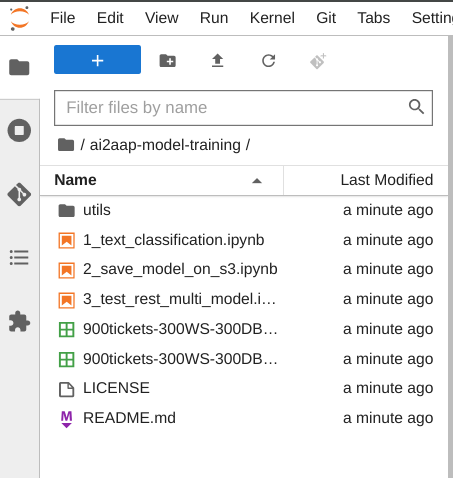

### The Incident Classification

The Jupyter Notebooks that we will see demonstrate how to train a
machine learning model on OpenShift AI to classify incident
descriptions, create a microservice to interact with the model, and use
Ansible Automation Platform to attempt automatic resolution. The process
involves updating ServiceNow incidents with progress and results and
reassigning for manual intervention if necessary. The demo utilizes a
hosted Ansible environment and a free OpenShift tenant for
demonstration.

### Model training: Text Classification notebook

Let's start with the first Notebook **1\_text\_classification.ipynb**,
this is the main Jupyter Notebook containing all the needed steps for
training an existing model with a custom dataset. Once opened you should
see the first steps that will guide us in the training activity as shown
in the following image.

#### Jupiter Notebook Quick Introduction

If you are not familiar with a Jupiter Notebook you may ask why there is
a mix of shell commands and Python code: Jupyter Notebooks are like
interactive coding documents.

They combine text, equations, visualizations, and code cells (Python, R,
etc.) in one place. You can run code, see the results, and add
explanations all within the notebook.

The mix of shell commands and Python code happens because:

-   Shell commands (e.g., pip install, ls) help you manage your
    environment, prepare data, and interact with the system directly
    from the notebook.

-   Python code is the core of your analysis, where you work with data,
    build models, and create visualizations.

This integration makes Jupyter Notebooks very versatile and a popular
tool for data science, research, and education.

#### Setup the prerequisites

In the first steps of our Notebook we will set up the workbench with all
the required libraries for correctly executing the training and the
fine-tuning of our model. After that we will also check if we have a
working git-lfs binary.

#### Git LFS

Git LFS (Large File Storage) lets you version large files (models,
datasets, etc.) without bloating your Git repository. It replaces large
files with small text pointers in Git, while storing the file contents
elsewhere. This keeps your repo small and fast, while still allowing you
to track changes to large files.

#### Hugging Face

Hugging Face is a platform and community focused on machine learning,
particularly natural language processing (NLP). It provides a Model Hub,
Tools and Libraries, Datasets, A Collaborative Community. Hugging Face's
purpose is to democratize AI and make cutting-edge NLP technology
accessible to everyone.

At the end of the preparation steps we will also login to Hugging Face
in case you want to save your custom model to the cloud.

#### Loading the dataset

After the prerequisites setup we can start working with our model, first
of all we need to defined and import a Dataset and a pretrained model as
shown in the following image.

A dataset in machine learning is a collection of examples used to train,
evaluate, and fine-tune a model. It typically consists of input features
(e.g., images, text) and corresponding labels or targets (e.g., image
categories, sentiment labels).

The model learns patterns from the dataset to make predictions or
decisions on new, unseen data. Think of it like a textbook for the
model, providing it with the information it needs to understand and
solve a specific task.

In our case the Dataset is already available on Hugging Face, it has
been created with the help of one of the Generative AI Assistant, asking
to create some IT Incident descriptions for three different categories:
"Webserver", "Database", "Filesystem".

The source CSV files are available in the repo for your convenience in
case you want to edit or import them from the local environment.

#### Training the mode

Now we are ready to take a look at the steps needed to train and
fine-tune a machine learning model.

Here we are not going step by step in the notebook but we will summarize
the process:

1\. **Preprocessing with AutoTokenizer**

-   Choosing a Pretrained Model: in our case we chose the DistilBERT
    model.

-   AutoTokenizer: The AutoTokenizer class from Hugging Face simplifies
    the process of loading the correct tokenizer for your chosen model

-   Tokenization:

    -   Tokenization: The tokenizer breaks your text data into smaller
        units (words, subwords) and converts them into numerical
        representations that the model understands.

    -   Attention Masks: It creates attention masks that help the model
        differentiate between actual words and padding tokens.

2\. **Evaluation Metrics**

-   Choosing the Right Metric: Select evaluation metrics that are
    relevant to your task. Common for text classification is the
    Accuracy

-   Defining Metric Computation: Create a function that takes the
    model's predictions and the true labels to calculate your chosen
    metric.

3\. **Training with AutoModelForSequenceClassification**

-   Task-Specific Model: For sequence classification (e.g., sentiment
    analysis, text classification), we are going to use
    AutoModelForSequenceClassification

-   Training Arguments: Use TrainingArguments to configure your training
    process

-   Trainer: The Trainer class orchestrates the training loop,
    evaluation, and checkpointing

-   Setting an optimizer function: You can leverage an optimizer
    function, setting the learning rate schedule, and some training
    hyperparameters.

The whole process should not last more than 30 minutes and at the end we
should be ready to test our model

#### OpenVINO model conversion

The last steps of the Jupyter notebook are needed to convert the model
in a format that the OpenVINO multi-model server, pre-integrated in
OpenShift AI, could run as a service. There are just a few lines of
code, as shown in the following image, and the process should be really
fast.

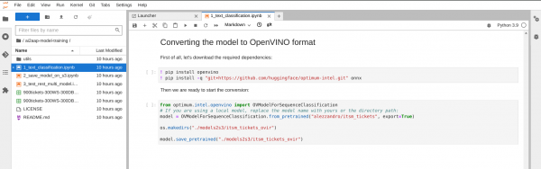

### Notebook execution

For starting the process and let all the steps to be executed
automatically you can just hit the **Run all cells** in the **Run**
section from the top bar of the JupyterLab environment:

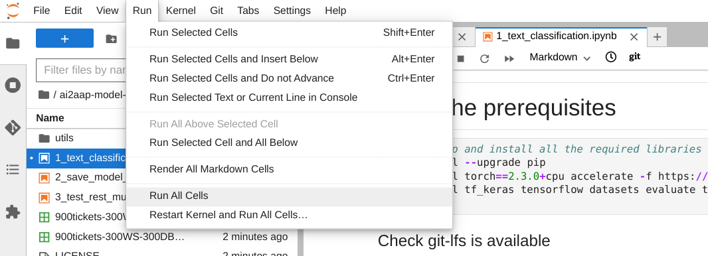

<table>
<colgroup>
<col style="width: 100%" />
</colgroup>
<thead>
<tr class="header">
<th>
<strong>NOTE:</strong> After running the first Python Notebook,
if you will see some output message in a red box like this one:

Please consider that often the Jupiter environment will output even
informative messages in a red box, you can discard them (or submit a fix
if you want! 🙂)
</th>
</tr>
</thead>
<tbody>
</tbody>
</table>

### Some considerations on the First Training Notebook

As you can see in the Jupyter notebook the notebook includes also a
small test of the model, as well as in the image below. During the test
we are going to verify the Incident classification with a static text
string, describing an IT Incident issue.

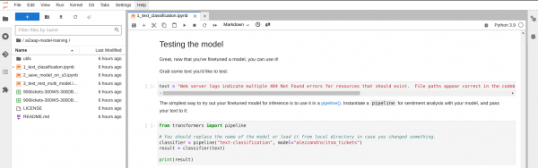

The lines of code create a text classification pipeline using the
pre-trained model named **alezzandro/itsm\_tickets**.This is the model
that we trained on a dataset of IT Service Management (ITSM) tickets
that can be used to classify new tickets into different categories.

As you can see in the image below the static text has been correctly
classified as a **Filesystem** incident.

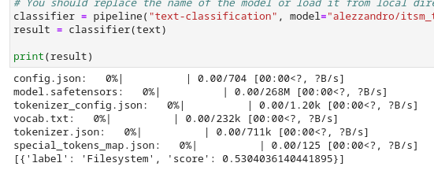

At the end of the conversion you can check the conversion output files
in the corresponding folder from the navigation left bar:

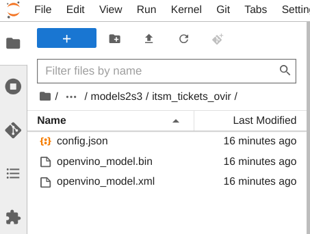

At this point we created a trained model in an OpenVINO format.

### Uploading the model on S3 Storage

Once created and converted the trained model, we are now ready to upload
it on S3 storage, so that our OpenVINO multi-model server can serve it.

The upload is performed by the **2\_save\_model\_on\_s3.ipynb**
notebook.

You can start the process and let all the steps be executed
automatically by hitting the **Run all cells** from the **Run** section
from the top bar of the JupyterLab environment.

### Deploy the model on OpenVINO multi-model server

#### OpenVINO quick introduction

OpenVINO Multi-Model Server (OVMS) is a high-performance solution for
deploying and serving multiple machine learning models simultaneously.

OpenVINO excels at:

-   **Efficiency**: Host various AI models within the same environment.

-   **Flexibility**: Support for multiple model formats and dynamic
    configuration.

-   **Performance**: Leverages OpenVINO's optimizations for Intel
    hardware.

-   **Ease of Use**: Standard APIs and compatibility with existing
    tools.

OVMS simplifies model deployment, handles versioning, and offers
additional features like model reshaping and pipeline serving. It's
ideal for developers, enterprises, and anyone needing to run multiple
models efficiently.

#### Model Deployment

Let's go back to the OpenShift AI console and start creating a new
multi-model server if it's missing.

-   Click on the **Models** tab

-   Click on the **Add model server** button

-   Fill the form with the following values:

    -   **Model server name**: ovms

    -   **Serving runtime**: OpenVINO Model Server

    -   **Model server replicas**: 1

    -   **Model server size**: Small

    -   **Accelerator** (if present): none

as shown in the following image.

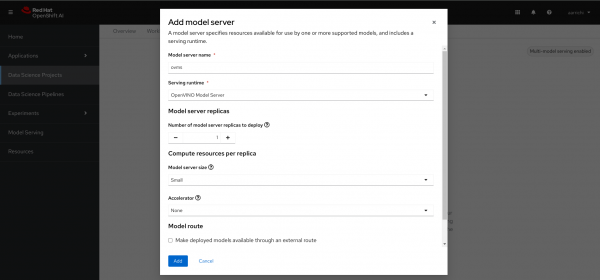

After that we are ready to deploy our trained model that we converted in
OpenVINO format and then uploaded on the S3 storage.

You should click the **Deploy model** button into the **ITSM** Model
Server and then fill the required inputs. Please fill the Deploy model
form with the following values:

-   **Model name**: itsmtickets

-   **Model framework**: openvino\_ir - opset1

-   **Model location**:

    -   Select **Existing Data connection**

    -   Select **My Storage**

    -   Path: **models/itsm\_tickets\_ovir**

    -   Click **Deploy** button

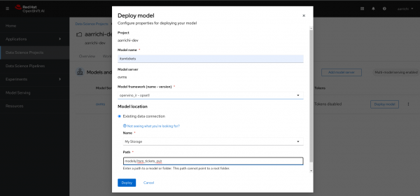

Once the deployment is complete, you should notice a green check mark
under OpenVINO server's tab, as shown in the following image.

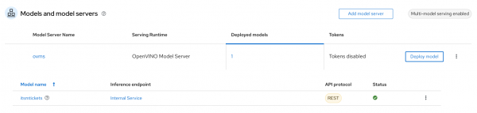

### Testing the model on OpenVINO multi-model server

Finally, we are ready to test the just deployed model on the OpenVINO
server.

We created a third Jupyter Notebook
**3\_test\_rest\_multi\_model.ipynb** containing all the libraries and
the code needed for interacting with it.

As you can see in the notebook's code, I've defined a function to create
a REST request for the OpenVINO server passing all the required
parameters.

After that, once we get the response, we will use another function to
match the right label predicted by the model, as described also in the
following image.

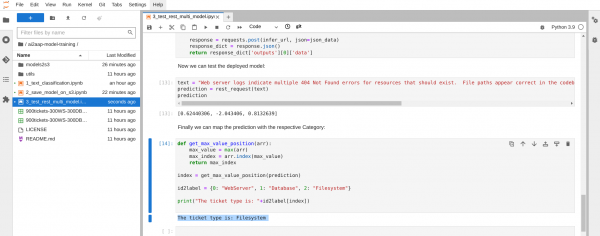

We are ready for the next steps of our demo: setup the microservices on
OpenShift to automatically interact with the ServiceNow instance +
Ansible Automation Platform + OpenShift AI.

## OpenShift Microservices Setup

In this section we will configure the two microservices that will
interact with ServiceNow, Ansible Automation Platform and with the model
served by OpenShift AI.

### Deploying the ai2aap-predict-text-ws microservice

To simplify the interaction with the AI/ML model on OpenShift AI we
created a small Python microservice.

This microservice acts as mediator between the ML model and any
internal/external service that would like to leverage it.

1.  Let’s login with **user1** credentials to our OpenShift Platform,
    then click on the **+Add** button in the left bar:  
    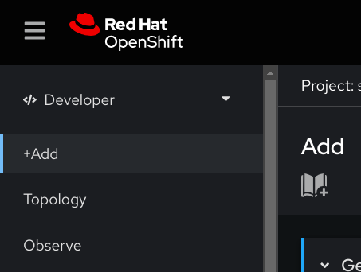

2.  Then we need to select **Import from git** from the “Git Repository”
    section: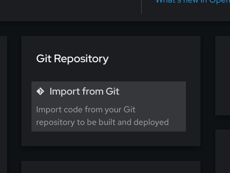

3.  Please insert the git repository url:
    “[<u>https://github.com/alezzandro/ai2aap-predict-text-ws</u>](https://github.com/alezzandro/ai2aap-predict-text-ws)”
    and fill in all the required fields:

-   **Application**: please select **Create application**

-   Application name: **ai2aap-predict-text-ws**

-   Name: **ai2aap-predict-text-ws**

-   Remove the checkmark from the Secure Route

-   Click on the **Create** button  
      
    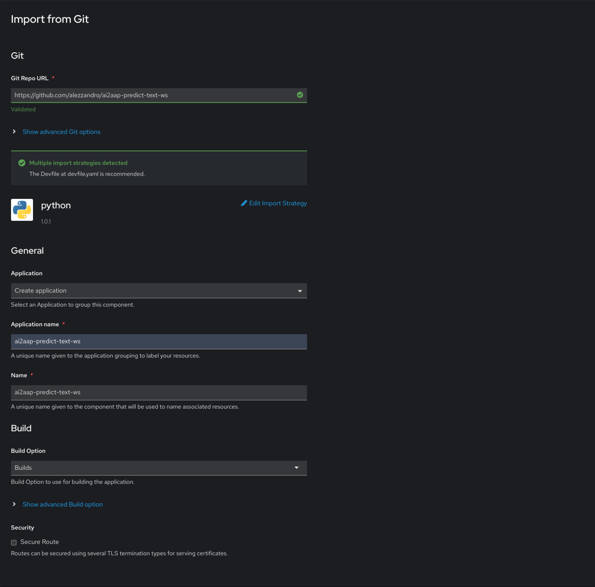

<table>
<colgroup>
<col style="width: 100%" />
</colgroup>
<thead>
<tr class="header">
<th><strong>IMPORTANT</strong>: if you used a different name for your
deployed model other than “<strong>itsmtickets</strong>” then you should
define an environment variable of the application Deployment named
“<strong>MODEL_NAME</strong>” containing your model’s name.</th>
</tr>
</thead>
<tbody>
</tbody>
</table>

The application build can take some minutes, at the end of the process
you should notice the microservice up and running from the OpenShift
topology view:

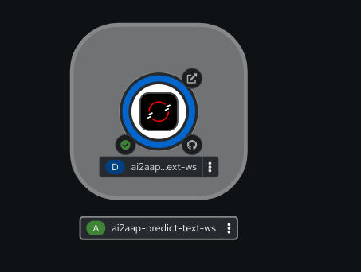

### The ai2aap-snow-incidents-resolution microservice

In order to get new unassigned incidents from ServiceNow we can use
another microservice written in Python that we created as an example to
show the capabilities of OpenShift.

1.  Let’s click again on on the “+Add” button in the left bar:  
    

2.  Please select “Import from git” from the “Git Repository” section:  
    

3.  Please insert the git repository url:
    “[<u>https://github.com/alezzandro/ai2aap-snow-incidents-resolution</u>](https://github.com/alezzandro/ai2aap-snow-incidents-resolution)”
    and fill in all the required fields:

-   **Application**: please select **Create application**

-   Application name: **ai2aap-snow-incidents-resolution**

-   Name: **ai2aap-snow-incidents-resolution**

-   Click on the **Create** button  
    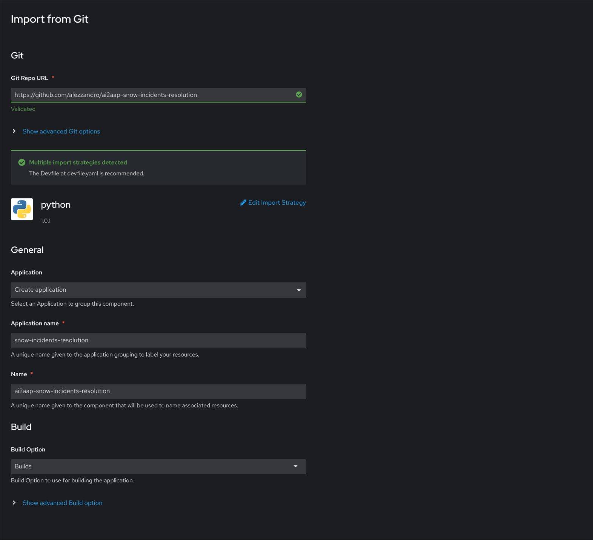

After the microservice’s build will start, we then need to create a
ConfigMap containing all the Data about the other environments created
before (ServiceNow, Ansible Automation Platform, and so on).

1.  Let’s click on the web-terminal icon from the top bar:  
    

2.  Apply the Secret manifest:

<table>
<colgroup>
<col style="width: 100%" />
</colgroup>
<thead>
<tr class="header">
<th>$ oc create -f
https://raw.githubusercontent.com/alezzandro/ai2aap-snow-incidents-resolution/refs/heads/main/secret.yaml</th>
</tr>
</thead>
<tbody>
</tbody>
</table>

1.  We can then move to the **Secrets** section from the left navigation
    bar. Then we need to click on the Secret named
    **ai2aap-config-secret**:

2.  Finally we need to click “Edit Secret” from the context drop down
    menu on the right. This will enable us to input all the required
    fields:

-   **SNOW\_URL:** This the URL of the ServiceNow instance. Something
    like this: “*https://dev268432.service-now.com*”

-   **SNOW\_USER:** The username we will leverage for managing
    ServiceNow Incidents. If you followed the previous sections, the
    username should be “**Incident.Manager**”

-   **SNOW\_PASS:** It’s the password for username we will leverage for
    managing ServiceNow Incidents. If you followed the previous
    sections, this is the password of the username
    “**Incident.Manager**”

-   **SNOW\_ASSIGNED\_TO:** It’s the ServiceNow’s UUID of the user we
    need to re-assign Incidents to in case the Ansible Automation
    Platform will fail to solve the issue. Take a look to the initial
    section, this should be something like:
    “***63b4c2cd0bb23200ecfd818393673a95***”

-   **AAP\_URL:** This is the URL of your AAP Controller, something
    like: *https://ansible-1.k528c.sandbox1805.opentlc.com*

-   **AAP\_USER:** The AAP Controller username (usually the user is
    “**admin**”)

-   **AAP\_PASS:** It’s the password for your user (usually the user is
    **admin**)

-   **AAP\_WF\_ID:** This is the Workflow ID to execute in Ansible
    Automation Platform to start the automatic incidents resolution. If
    you just imported the Ansible Templates by the JSON file following
    this guide, the ID should be “**8**”. The easiest way to find the ID
    for a given AAP Template is to open the Template’s Details in the
    AAP web interface and find the ID in the address bar.

-   **ML\_WS\_URL:** The URL for the Python microservice we deployed
    earlier. If you deployed in the same OpenShift project as suggested
    in this guide, then
    “**http://ai2aap-predict-text-ws:8081/predict\_text**” should be
    enough.

-   **AAP\_BASE\_PATH**: if you are usin AAP 2.5 should be
    **/api/controller/** otherwise **/api**

1.  Click on the **Save** button

After updating the Secret with the correct information, then we should
attach it to the Deployment of our just created microservice. Let’s
click on the top right button **Add Secret to workload**

Then we should select the Deployment for our microservice
**ai2aap-snow-incidents-resolution** and then press the **Save** button:

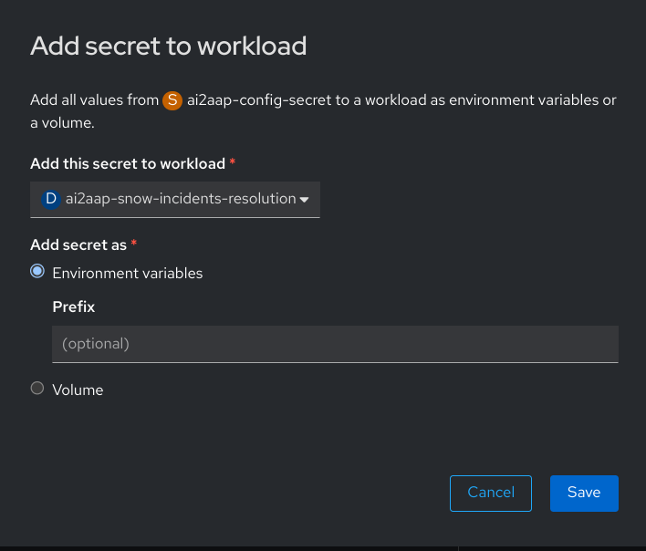

Now the deployment should restart

<table>
<colgroup>
<col style="width: 100%" />
</colgroup>
<thead>
<tr class="header">
<th><strong>NOTE:</strong> in case the Deployment/Pod is still in
CrashLoopBack failure due to the lack of the correct information, you
can restart it by deleting the existing pod or scaling down and then
scaling up the deployment</th>
</tr>
</thead>
<tbody>
</tbody>
</table>

We are now ready for the last part of our demo, testing the entire
workflow by generating new tickets on ServiceNow!

## Create Incidents on ServiceNow and monitor the automatic resolution

### The incidents creation script

The last step of our demo is to create new Incidents on ServiceNow to
execute automation on target hosts for resolving issues automatically.

Instead of manually creating the incidents in ServiceNow we prepare a
small python script that could help us in the process and test three
types of Incidents:

-   Webserver

-   Database

-   Filesystem

After logging on OpenShift with **user1**, we can login in the OpenShift
AI interface by clicking on the square icon on the top bar and then
selecting the entry **Red Hat OpenShift AI**:

In case the platform requests a login again, you should use the same
**user1** credentials used before. Let’s click on the Data Science
project named **snow-incident-resolution**:

Then we can connect again to the running workbench environment we used
in the previous sections:

Click **Open** link to access the previously created environment, you
will be prompted to authorize the login via your OpenShift credentials.

First of all, let’s open a terminal window by clicking on the menu
**File** -&gt; **New** -&gt; **Terminal**

You should see something like this after launching the Terminal:

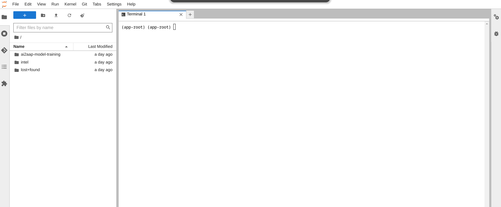

Then we can move the **utils** directory to find the Python scripts:

<table>
<colgroup>
<col style="width: 100%" />
</colgroup>
<thead>
<tr class="header">
<th>cd ai2aap-model-training/utils/</th>
</tr>
</thead>
<tbody>
</tbody>
</table>

You will find the Python script snow\_incidents\_create.py.

We will use this script to create incidents in ServiceNow.

Before running the script we need to set up the ServiceNow URL and the
credentials needed to connect with, you can export the proper
environment variables as below. Please use the second Service Now user
we previously set, if you followed the instructions should be
**Alejandro Mascall**. In order to do so please configure the
environment variables:

<table>
<colgroup>
<col style="width: 100%" />
</colgroup>
<thead>
<tr class="header">
<th>
export SNOW_URL="https://YOUR_INSTANCE.service-now.com/"

export SNOW_USER="alejandro.mascall"

export SNOW_PASSWORD="PASSWORD" # Alejandro Mascall pwd you saved
before
</th>
</tr>
</thead>
<tbody>
</tbody>
</table>

As you can see from the screenshot above you will also find a fourth
variable containing the descriptions of the Incidents that will be
opened on the ServiceNow instance. You can customize them if you want.

### Monitoring Ansible Jobs

Before running the script, please open another tab on your web browser
pointing to the Jobs page of your Ansible Automation Platform to check
if any Ansible Jobs will start soon.

You can find the Jobs list by clicking on the tab **Jobs** available in
the left navigation bar of your Ansible Automation Platform:

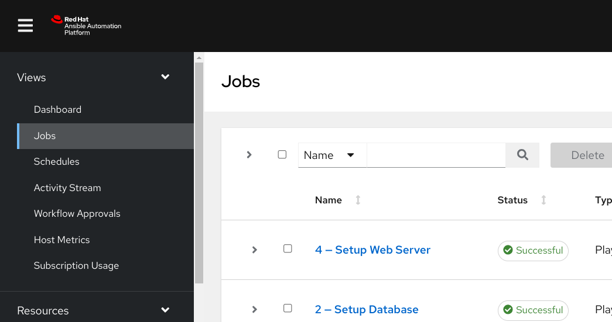

### Monitoring the OpenShift microservice

Then you could also open the logs of the Python microservice that will
get the incidents from ServiceNow.

You can access the Pod’s logs easily by clicking from the OpenShift
Topology view on the **snow-incidents-resolution** application and then
select **View Logs** in the **Pods** section in the right navigation
pane.

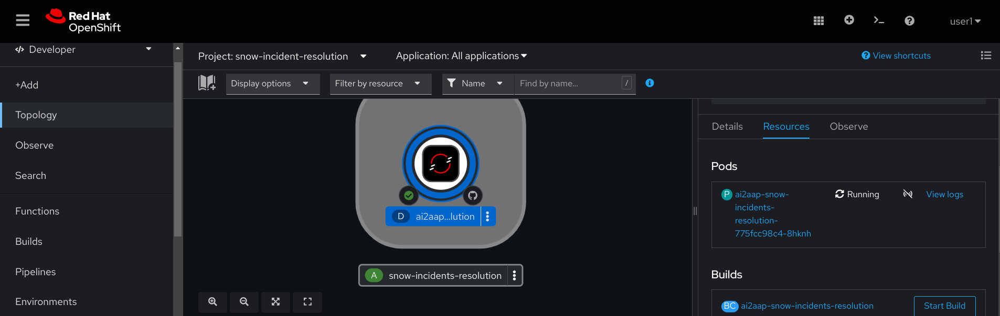

You should see something like this:

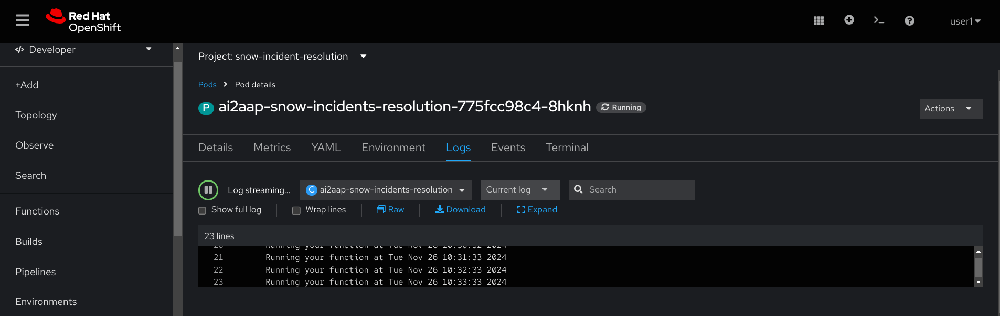

### Monitoring tickets on ServiceNow

Finally you can also open the Incidents list on ServiceNow, just login
as Administrator by following the link in the main page of ServiceNow
portal:
[<u>https://developer.servicenow.com/dev.do#!/home</u>](https://developer.servicenow.com/dev.do#!/home)

Then search and click on the **Incidents** section under **Service
Desk**:

The list should be empty because we deleted any Incidents in the initial
environment configuration.

Right now you should have on your monitor four browser tabs:

1.  The terminal on OpenShift AI’s Jupiterlab

2.  AAP Jobs page

3.  The OpenShift Microservice pod logs

4.  Incidents page on ServiceNow

### Incidents creation

Come back to the Terminal on OpenShift AI’s Jupiterlab environment and
let’s run our script:

<table>
<colgroup>
<col style="width: 100%" />
</colgroup>
<thead>
<tr class="header">
<th>
$ export SNOW_URL="https://YOUR_INSTANCE.service-now.com"

$ export SNOW_USER="alejandro.mascall"

$ export SNOW_PASSWORD=”your password”

$ ./snow_incidents_create.py predefined
</th>
</tr>
</thead>
<tbody>
</tbody>
</table>

<table>
<colgroup>
<col style="width: 100%" />
</colgroup>
<thead>
<tr class="header">
<th><strong>NOTE:</strong> executing the script with the argument
<strong>predefined</strong>, the python code will create three
incidents, one for each category. Using the argument
<strong>custom</strong>, instead, the script will ask for the incident
description and the node affected.</th>
</tr>
</thead>
<tbody>
</tbody>
</table>

You should see something like this on your terminal indicating that
ServiceNow has now three new tickets opened and unassigned:

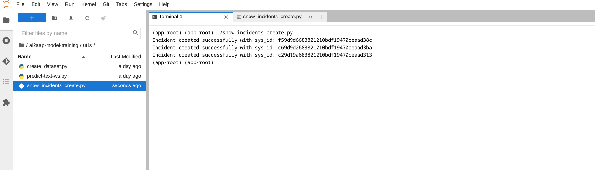

After that we can go to check the logs of our Python microservice and as
well the Ansible Automation Platform Dashboard looking for any Ansible
Jobs running.

On the Python microservice running on OpenShift you should see something
similar in the logs:

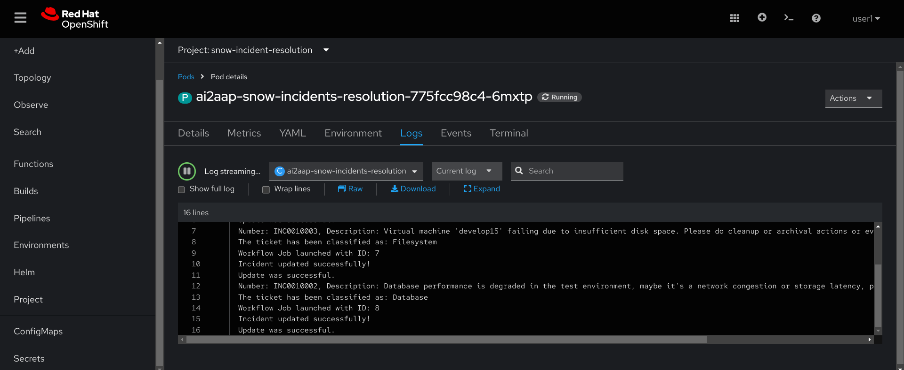

The previous messages should indicate that our microservice correctly
pulled down the tickets, taking the ownership and starting to work on
them calling Ansible Automation Platform.

In fact, taking a look in the Ansible Automation Platform in “Jobs”
section we can see that there are multiple Jobs running:

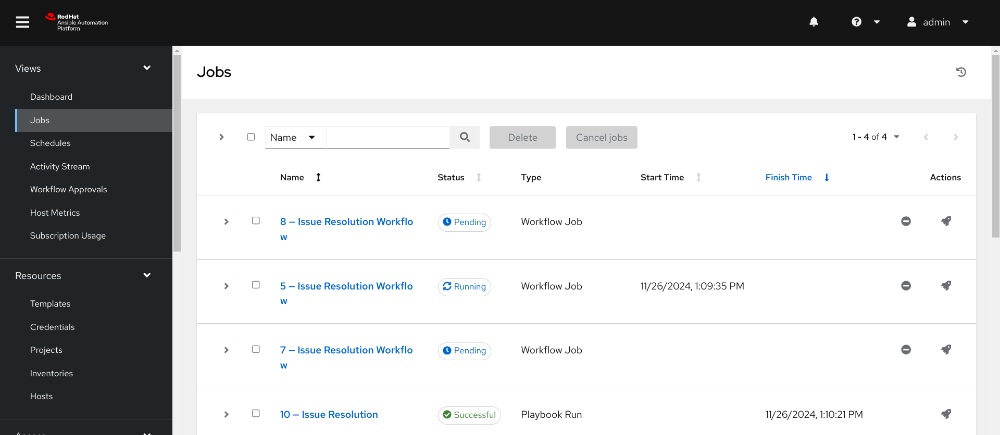

<table>
<colgroup>
<col style="width: 100%" />
</colgroup>
<thead>
<tr class="header">
<th><strong>NOTE:</strong> you can filter the Jobs and check only the
type <strong>Workflow</strong>, this will improve the presentation to
the customer.</th>
</tr>
</thead>
<tbody>
</tbody>
</table>

Moving to the ServiceNow Incidents list, as you can see we have three
new tickets on which Ansible Automation Platform is working on:

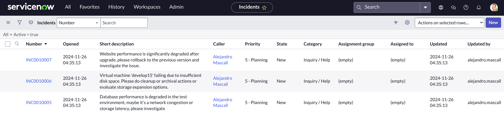

Switching back to the Ansible Jobs list and selecting one of the running
Ansible **Workflow** job we can visualize graphically the decision tree,
you should see something like this:

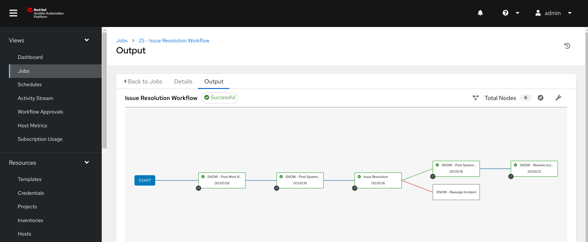

Selecting the tab “Details” you can discover the Incident Number/ID and
which category the AI model has made an association with:

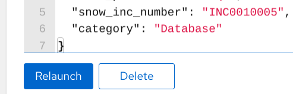

Once the Workflow Jobs will end (in some minutes, you can spend some
time showing Ansible Output and talking about Ansible capabilities) you
can move to ServiceNow again, to inspect the status of the incidents.

You can click on of the Incidents showing how Ansible grabbed logs from
the running target systems and updated the Incident autonomously:

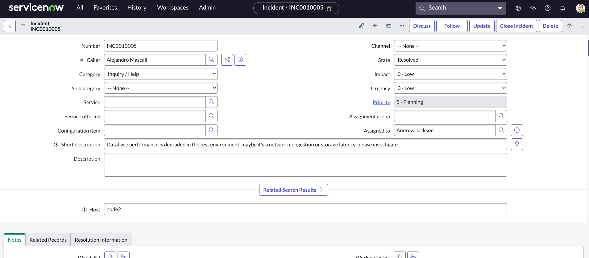

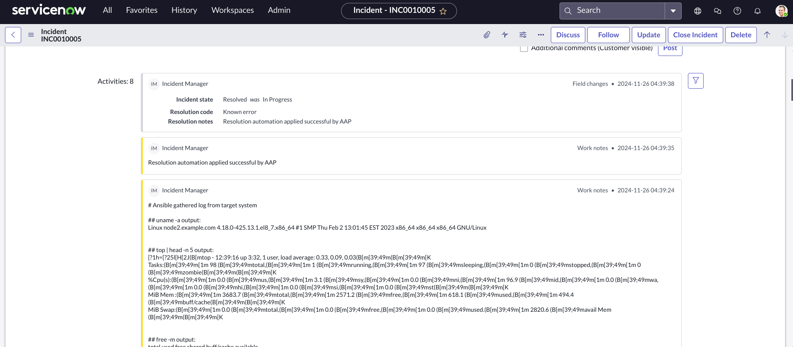

The script has generated three different incidents that should be
categorized one for each of the three categories: **Webserver**,
**Database** and **Filesystem**.

The Workflow Automation Job for the Filesystem ticket should fail so you
can even show to the customer what could happen in case something
happens and the automation fails:

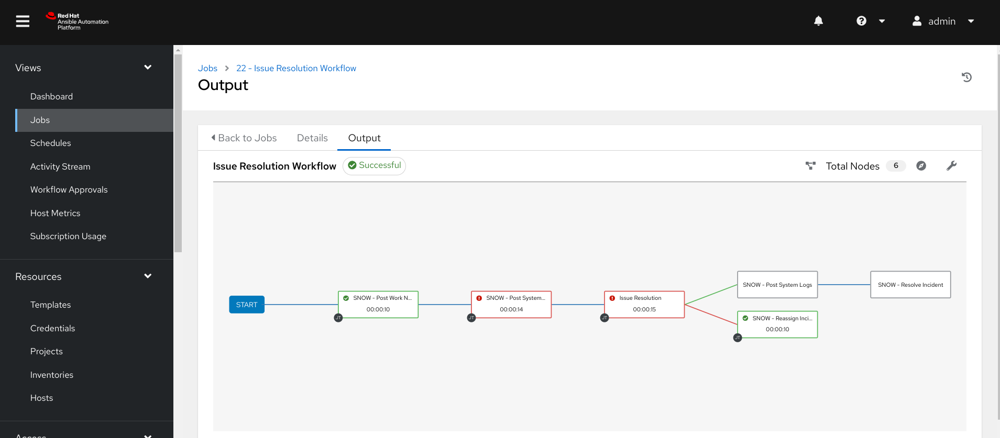

As you can see from the previous image the automation failed and so the
Incident has been reassigned for manual intervention to another user
“Problem Administrator”:

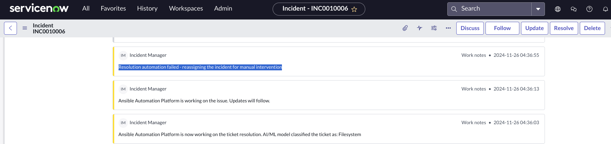

This ends up the demo setup and the demo showcase as well!

If you arrived here, congratulations! 😁 We didn’t imagine that someone
could arrive til the end after 50 pages of setup and instructions! 😃

[1] [<u>https://www.servicenow.com/community/developer-forum/how-to-create-a-new-field-on-incident-table/m-p/2999705</u>](https://www.servicenow.com/community/developer-forum/how-to-create-a-new-field-on-incident-table/m-p/2999705)
