## Table of Contents

- [Prerequisite](#prerequisite)
- [Data Science Kubeflow setup](#data-science-kubeflow-setup)
  - [Data Science Pipeline Application setup](#data-science-pipeline-application-setup)
  - [Data Science Projects setup](#data-science-project-setup)
  - [Workbench setup](#workbench-setup)
- [Run Kubeflow Pipeline](#run-kubeflow-pipeline)
  - [Execute Kubeflow pipeline from Workbench](#execute-kubeflow-pipeline-from-workbench)
  - [Look at the Kubeflow Pipeline execution](#look-at-the-kubeflow-pipeline-execution)
- [OpenShit Pipeline setup](#openshit-pipeline-setup)
  - [Create Tekton Pipeline](#create-tekton-pipeline)
  - [Run Tekton Pipeline](#run-tekton-pipeline)
  - [Pipeline results](#pipeline-results)
- [Credits](#credits)

## Prerequisite
- OpenShift AI 2.9

## Data Science Kubeflow setup

#### Data Science Pipeline Application setup

The following steps will deploy all the needed components to support execution of Kubeflow pipelines.

1. Create an Object Bucket to store the Kubeflow pipeline tasks artifacts
    Example: [Nooba Object Storage](pipeline/dspa-obc.yaml)
2. Create the `DataSciencePipelinApplication` CR, and customize the `objectStorage` section to match the details of the Object Storage created in the previous step
    Example: [Using insecure s3 storage access](pipeline/dspa.yaml)

#### Data Science Project setup

1. Create a Data Science project in OpenShift AI
    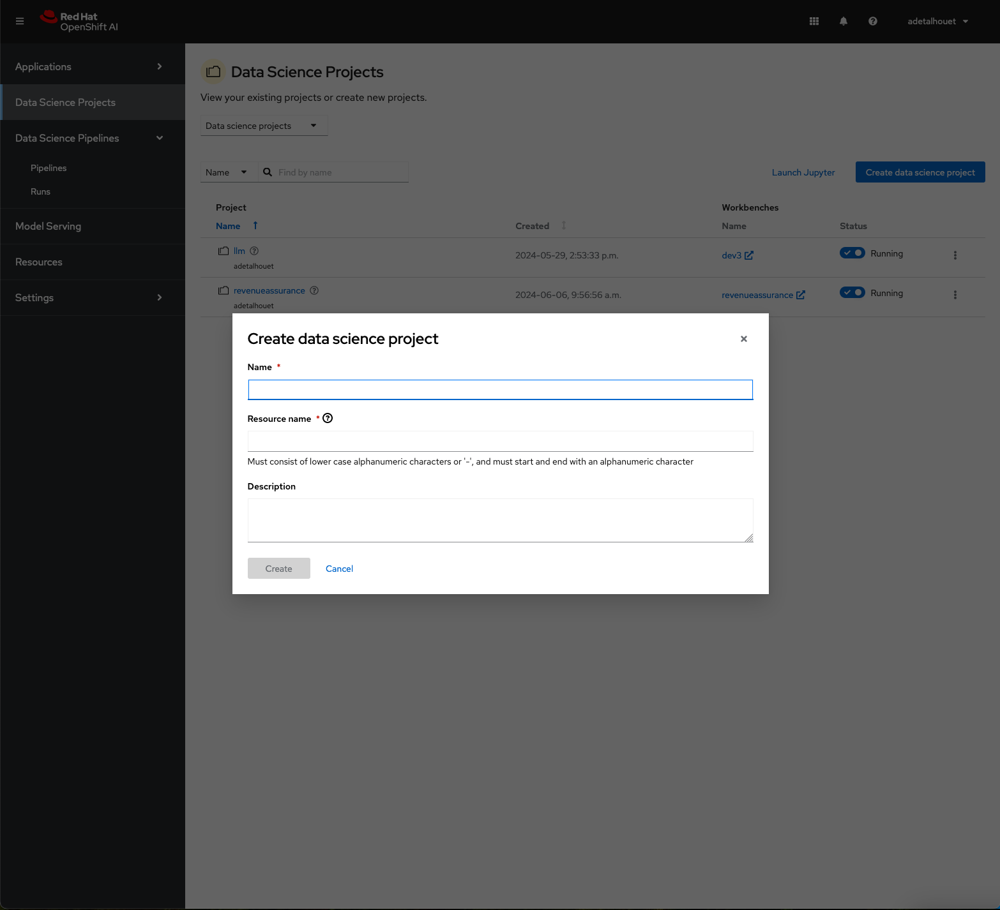
2. Create a Workbench
    - Use `PyTorch 2024.1` Notebook image
    - Create or Use a persistent volume
    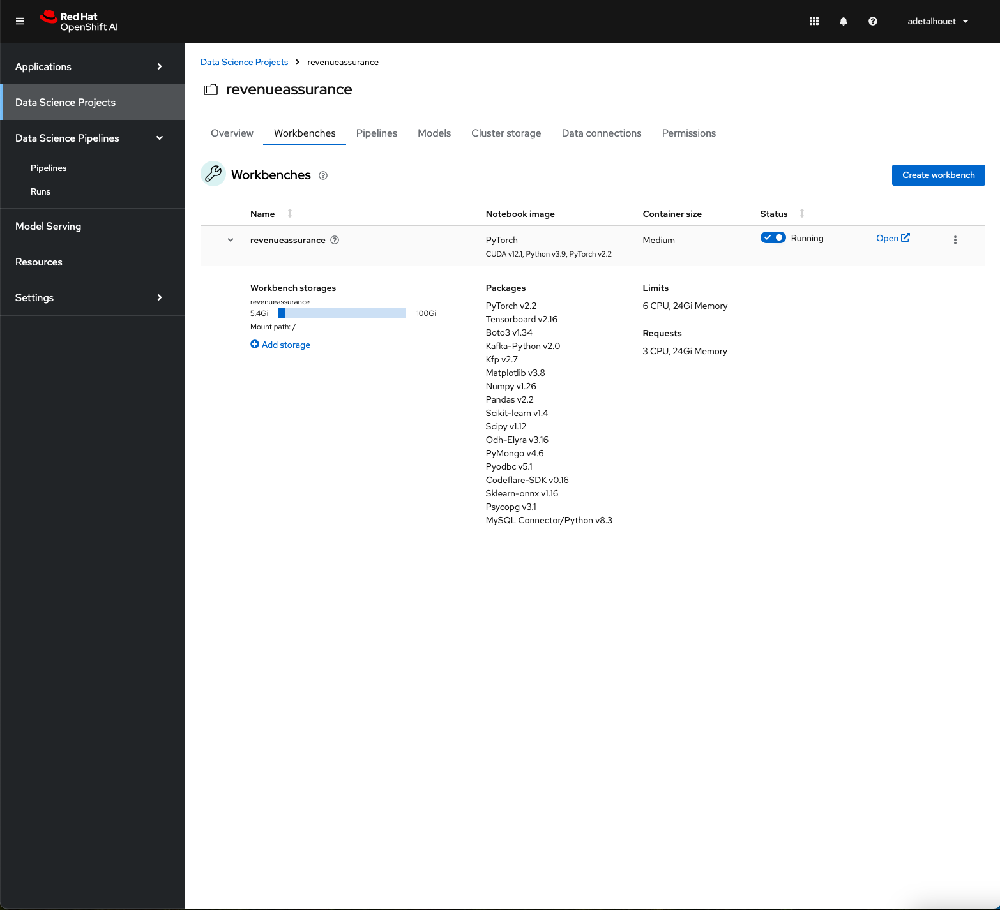

#### Workbench setup

1. Once the Notebook is up and running, clone the repo
    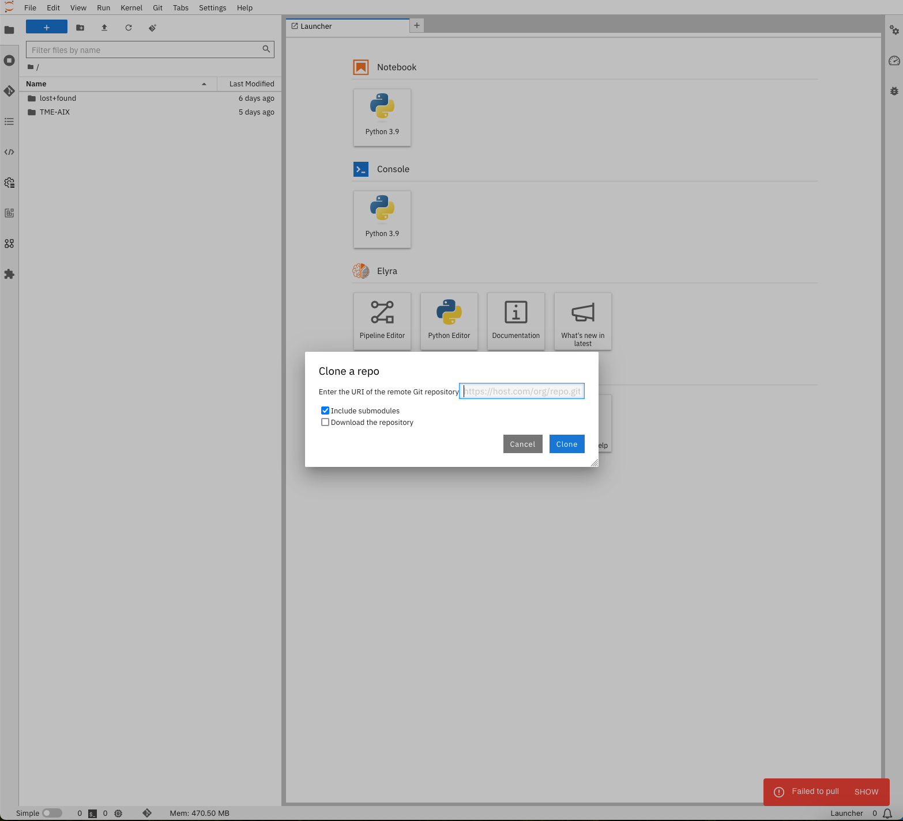
2. Setup the Data Science Pipeline Runime in your Notebook environment. This will point to the Kubeflow endpoint setup in the previous steps
    - Data Science Pipelines API Endpoint: this is the K8s service name created by the Data Science Pipeline Application.
    - Data Science Pipleins engine: OpenShift AI 2.9 uses Argo as the Kubeflow pipeline engine.
    - Authentication Type: Given the execution happens from within a pod, use `KUBERNETES_SERVICE_ACCOUNT_TOKEN` that will be fetch locally.
    - Cloud Object Storage: the configuration should point to the Object Bucket details created in the previous step.
    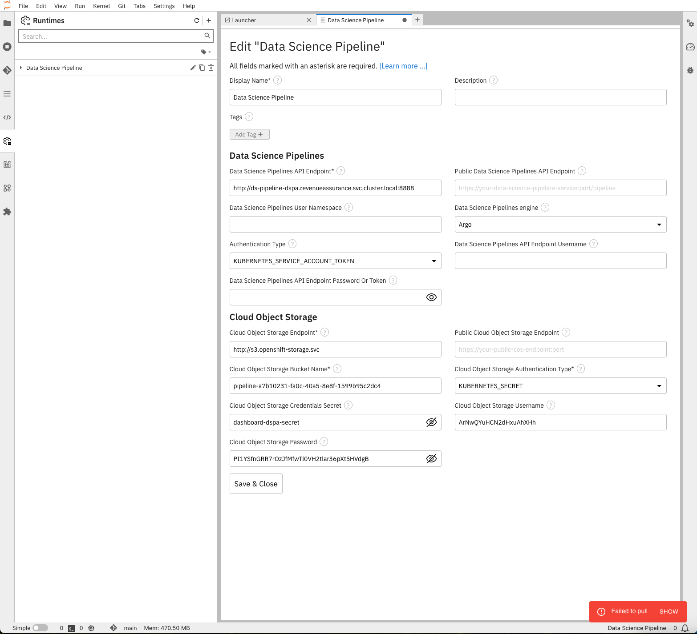
4. On the Terminal, install the following
    `pip install pipenv`
5. Install all the required python modules from the Pipfile
    `pipenv install`

## Run Kubeflow Pipeline

#### Execute Kubeflow pipeline from Workbench

The Kubeflow pipeline is built to be executed from the Tekton pipeline, enabling full end to end mlops automation. But for development purposes, one might want to trigger the pipeline from within the Workbench.
To do so, it is required to run the tekton pipeline first, as it will build the python environmnent used to execute the various kubeflow tasks.

Then, you need to update the Kubeflow pipeline file by hardcoding the default `kubeflow_endpoint` and `base_image` to your local environment, or, add the appropriate environment variable to the workbench.
Example: 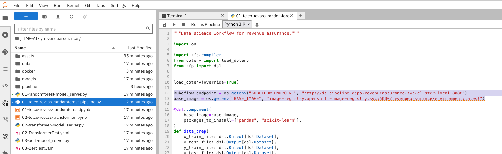

They are two ways to run the Kubeflow Pipeline:
- either from the Terminal: `python 01-telco-revass-randomforest-pipeline.py`
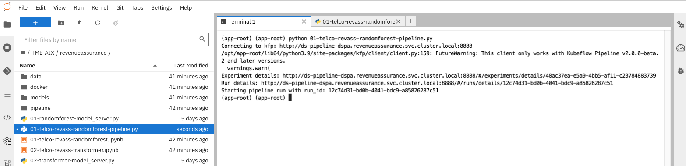
- either from the python file:
    - click `Run as Pipeline` 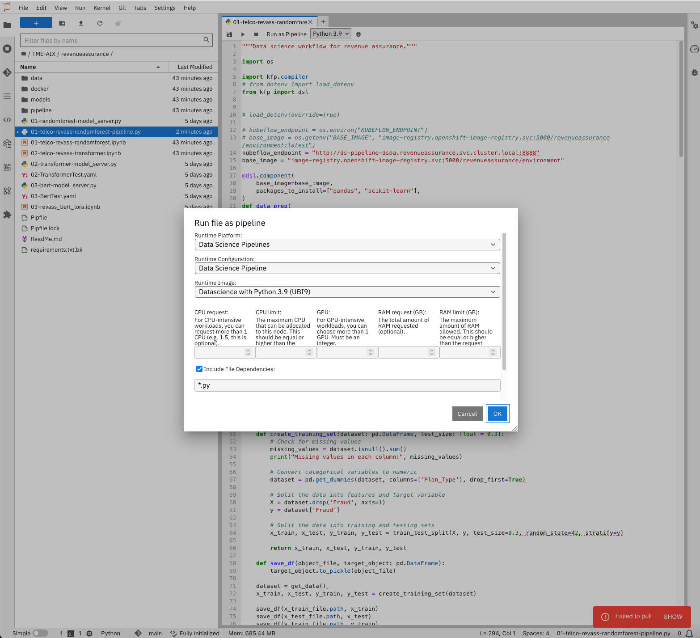 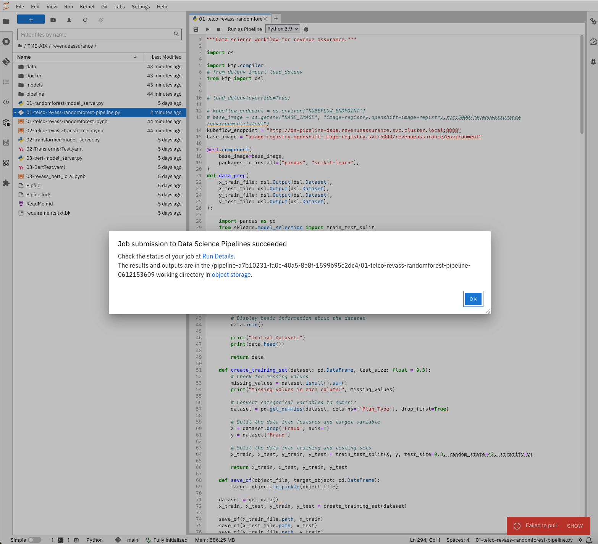
    - or click the `Run` button 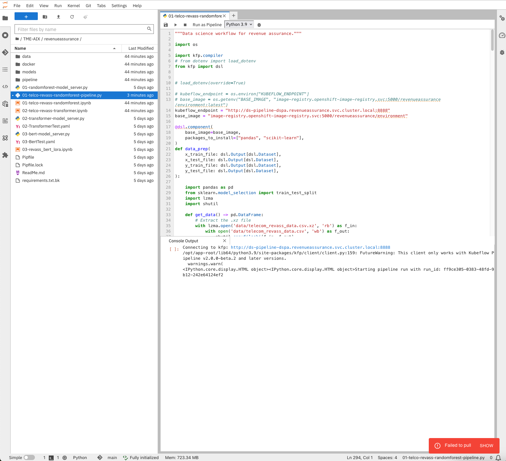

#### Look at the Kubeflow Pipeline execution

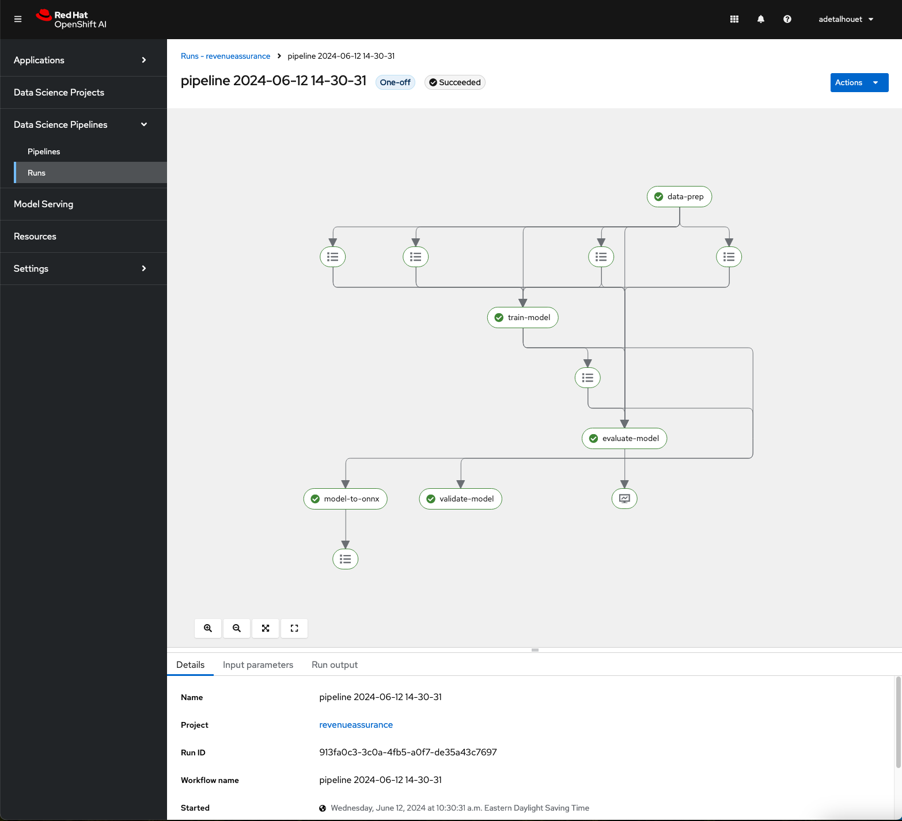

## OpenShit Pipeline setup

#### Create Tekton Pipeline

1. All the manifests are provided. Customize them based on your needs, then apply `oc apply -f pipeline`. The pipeline have the following steps
    - Clone the repository
    - Building the python environmnet image based on the Pipfile
    - Execute the Kubeflow pipeline which will save the model in the configured Object Bucket in previous steps
    - Build a OCI artifact containing the model created and validate in the Kubeflow pipeline
    - Build the Application container image using the above model OCI artifact.
2. Check the created pipeline
    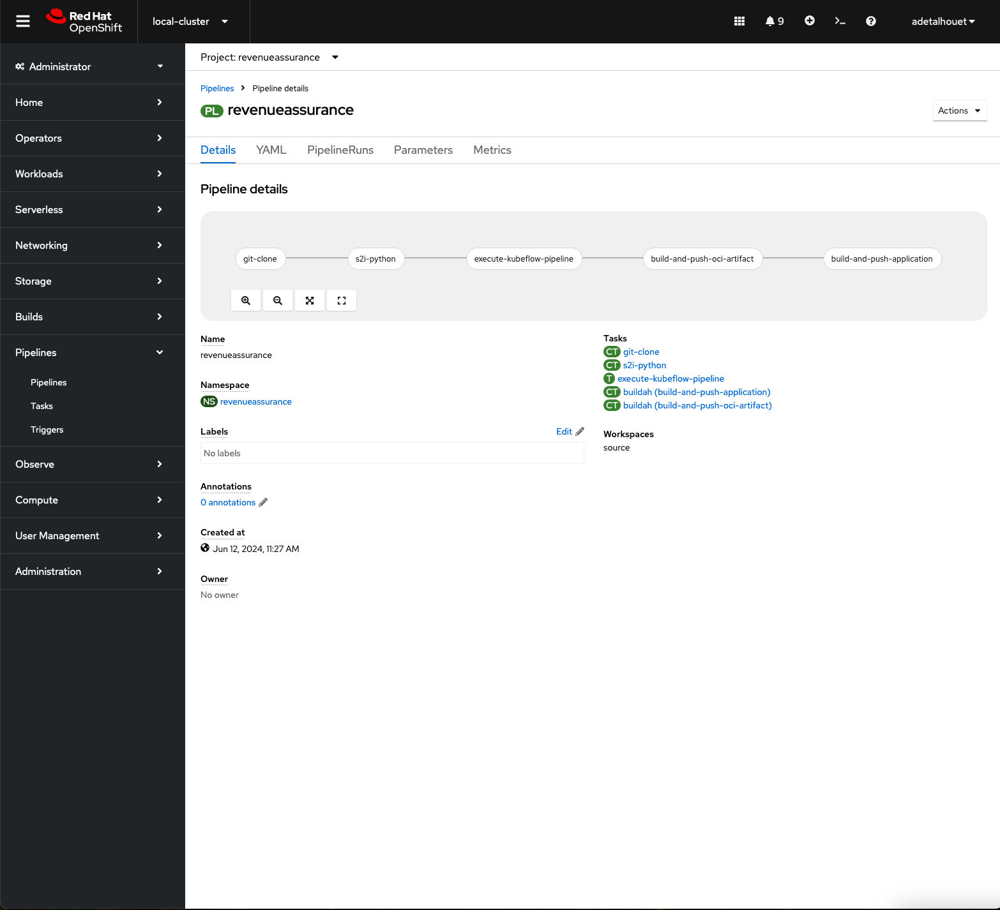
3. Give the `pipeline` ServiceAccount access to the local image registry so it can push images there.
    ```
    $ oc policy add-role-to-user registry-editor -z pipeline -n revenueassurance
    ```

#### Run Tekton Pipeline
To run the Tekton Pipeline, you have to supply the following information:
- KUBEFLOW_ENDPOINT: points to the https K8s service endpoint created previously
- Object Bucket details: provide the access_key, secret_key and bucket_name of the object bucket created previsouly (used to retrieve model created in the kubeflow pipeline)
- Provide a PV for the workspaces (used to shared data between Tekton pipeline tasks)

#### Pipeline results

After a few minutes, you should see the pipeline sucessful.
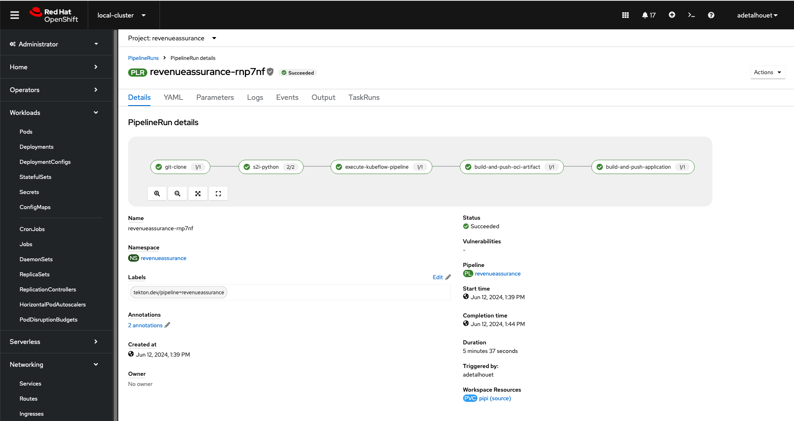

At this point, the following container images have been created and stored in the OpenShift internal registry:
- `image-registry.openshift-image-registry.svc:5000/revenueassurance/environment`: environment used to execute kubeflow pipeline tasks.
- `image-registry.openshift-image-registry.svc:5000/revenueassurance/model:1-1.0`: OCI artifact containing the built model
- `image-registry.openshift-image-registry.svc:5000/revenueassurance/app:1-1.0`: model serving application

## Credits
- [Kubeflow Pipeline Examples](https://github.com/redhat-ai-services/kubeflow-pipelines-examples/tree/main)
- [Red Hat OpenShift AI Accelerator](https://github.com/redhat-ai-services/ai-accelerator/tree/main/tenants/ai-example)
- [Trevor Royer](https://github.com/strangiato)
